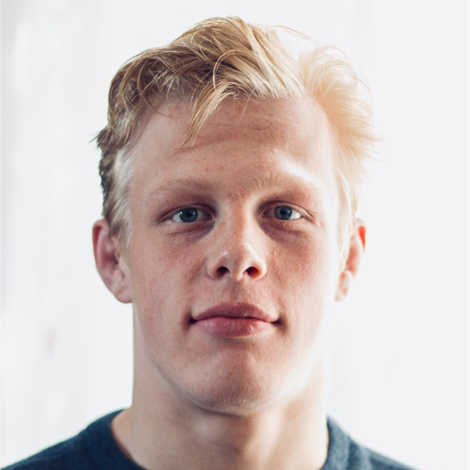

## About me
My name is Lars van Oostrum, and I am both a judoka for the Dutch National team and a Master's student in Econometrics at the University of Groningen. can 

## About the blog
On this blog, I will try to post about a variety of subjects I find interesting.
This will mainly be around applying math, econometrics and data science to sports, just what triggers my interest at the time.

